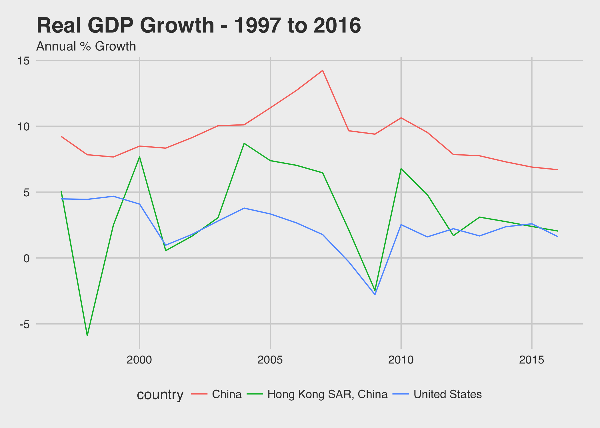

Hong Kong Economy
================
2017/08/01

-   [Aim](#aim)
-   [Real GDP](#real-gdp)
-   [References](#references)

Aim
---

-   understand key statistics of hong kong's economy in the past 20 years.
-   a showcase of beautiful charts

Real GDP
--------

``` r
gdp_cat <- WDIsearch("gdp")

gdp_growth <- WDI(indicator="NY.GDP.MKTP.KD.ZG", country = c("HK", "CN", "US"),
                  start=1980, end=2017)

gdp_growth_sum_st <- gdp_growth %>%
  filter(year >= 1997) %>%
  group_by(country) %>%
  summarise(mean_growth = round(mean(NY.GDP.MKTP.KD.ZG),2),
            sd_growth =  round(sd(NY.GDP.MKTP.KD.ZG),2))

kable(gdp_growth_sum_st)
```

| country              |  mean\_growth|  sd\_growth|
|:---------------------|-------------:|-----------:|
| China                |          9.25|        1.93|
| Hong Kong SAR, China |          3.38|        3.56|
| United States        |          2.32|        1.75|

Real GDP growth in China, on average, is some 9%, around 3 times faster than the US and Hong Kong.

``` r
gdp_growth_plot <- gdp_growth %>%
  filter(year >= 1997) %>%
  ggplot(.,aes(x = year, y = NY.GDP.MKTP.KD.ZG, group = country)) + geom_line(aes(colour = country)) + theme_fivethirtyeight() +
  labs(title = "Real GDP Growth - 1997 to 2016", subtitle = "Annual % Growth")

gdp_growth_plot
```



References
----------

-   [how to use WDI package in R](https://cran.r-project.org/web/packages/WDI/README.html)
